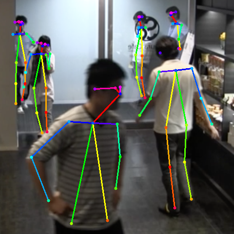

[Original REAMDE.md](./README_original.md)

## Released Network Architecture


**Used caffe Layer types**  

    type: "Convolution"
    type: "Pooling"
    type: "ReLU"

### Environment for test

- python3
- chainer==5.2.0
- ubuntu 16.04
- eog

## Download and first move

github repo.
```
$ git clone https://github.com/k5iogura/Chainer_Realtime_Multi-Person_Pose_Estimation
$ cd Chainer_Realtime_Multi-Person_Pose_Estimation
```

prototxt and caffemodel
```
$ cd models
$ wget https://raw.githubusercontent.com/ZheC/Realtime_Multi-Person_Pose_Estimation/master/model/_trained_COCO/pose_deploy.prototxt
$ wget http://posefs1.perception.cs.cmu.edu/OpenPose/models/pose/coco/pose_iter_440000.caffemodel
$ wget http://posefs1.perception.cs.cmu.edu/OpenPose/models/face/pose_iter_116000.caffemodel
$ wget http://posefs1.perception.cs.cmu.edu/OpenPose/models/hand/pose_iter_102000.caffemodel
```

convert them.
```

$ python3 convert_model.py posenet pose_iter_440000.caffemodel coco_posenet.npz
$ python3 convert_model.py facenet pose_iter_116000.caffemodel facenet.npz
$ python3 convert_model.py handnet pose_iter_102000.caffemodel handnet.npz
$ cd ..
```
testing...

pose_deploy.prototxt: prototxt coresponding to caffemodel  
pose_iter_440000.caffemodel: trained by Multi Persons pose inference  
convert_model.py :convert from caffemodel to chainer .npz  


```
$ python3 pose_detector.py posenet models/coco_posenet.npz --img data/person.png
$ eog result.png
```


and one more,,,

```
$ python3 pose_detector.py posenet models/coco_posenet.npz --img data/people.png
$ eog result.png
```


## Investigate memory layout of inference engine

Modify inference part in pose_detecctor.py to check memory layout of result.  

    class PoseDetector(object):
      def __call__(self,img):
      ...
          print("x_data.shape",x_data.shape,type(x_data))
          h1s, h2s = self.model(x_data)
          print("len(h1s)",len(h1s),type(h1s))
          print("len(h2s)",len(h2s),type(h2s))
          print("h1s[-1].shape",h1s[-1].shape,type(h1s))
          print("h2s[-1].shape",h2s[-1].shape,type(h2s))

          pafs = F.resize_images(h1s[-1], (map_h, map_w)).data[0]
          heatmaps = F.resize_images(h2s[-1], (map_h, map_w)).data[0]
          print("pafs.shape",pafs.shape,type(pafs.shape))
          print("heatmaps.shape",heatmaps.shape,type(heatmaps.shape))
      ...

result..  

    Loading the model...
    x_data.shape (1, 3, 368, 368) <class 'numpy.ndarray'>
    len(h1s) 6 <class 'list'>
    len(h2s) 6 <class 'list'>
    h1s[-1].shape (1, 38, 46, 46) <class 'list'>
    h2s[-1].shape (1, 19, 46, 46) <class 'list'>
    pafs.shape (38, 320, 320) <class 'tuple'>
    heatmaps.shape (19, 320, 320) <class 'tuple'>


So,  
**input layer size is ( 1,3,368,368 )**  
**output layer size heatmaps( 19,320,320 ) and pafs( 19*2,320,320 )**  

- **h1s means pafs    (1,38,320,320)**
- **h2s means heatmaps(1,19,320,320)**
- **19 parts of human keypoints may be represented.**
- **320 x 320 spacial dimention may be represented.**
- **320 = 46 x 8 upsampling result.**
- **46 is output spacial dimemsion of Network.**
- **pafs includes vector of X and Y.**

### Make pafs and heatmaps by OpenVINO inteference engine

### Convert caffemodel to IRmodel

convertion.
```
    $ cd models
    $ $MO/mo_caffe.py --input_model pose_iter_440000.caffemodel
    --output_dir FP32 --data_type=FP32
    --output Mconv7_stage6_L2,Mconv7_stage6_L1
    $ ls FP32/
      pose_iter_440000.bin  pose_iter_440000.mapping  pose_iter_440000.xml
```

### Investigate OpenVINO inference engine result
sctipt to try.
```
# IEbase.py
data_type="FP32"
model_xml=data_type+'/pose_iter_440000.xml'
model_bin=data_type+'/pose_iter_440000.bin'

def IEsetup(model_xml, model_bin, device):
    plugin = IEPlugin(device=device, plugin_dirs=None)
    libcpu = "inference_engine_samples/intel64/Release/lib/libcpu_extension.so"
    libcpu = os.environ['HOME'] + "/" + libcpu 
    if device == "CPU":plugin.add_cpu_extension(libcpu)
    net = IENetwork(model=model_xml, weights=model_bin)

    exec_net = plugin.load(network=net, num_requests=1)

    input_blob = next(iter(net.inputs))  #input_blob = 'data'
    model_n,model_c,model_h,model_w=net.inputs[input_blob].shape
    for out_blob in net.outputs:
        print("n/c/h/w(from xml)=%d %d %d %d"%(model_n,model_c,model_h, model_w))
        print("input_blob : out_blob =",input_blob,":",out_blob)
        print("net.outputs[",out_blob,"].shape",net.outputs[out_blob].shape)
    del net
    return exec_net, plugin

exec_net, plugin = IEsetup(model_xml, model_bin, "CPU")
```

result of try.
```
    $ python3 IEbase.py
      n/c/h/w (from xml)= 1 3 368 368
      input_blob : out_blob = data : Mconv7_stage6_L1
      net.outputs[ Mconv7_stage6_L1 ].shape [1, 38, 46, 46]
      n/c/h/w (from xml)= 1 3 368 368
      input_blob : out_blob = data : Mconv7_stage6_L2
      net.outputs[ Mconv7_stage6_L2 ].shape [1, 19, 46, 46]
```

**layer Mconv7_stage6_L1:**  
  size is ( 1, 38, 46, 46 ) correspoding to **pafs** h1s of chainer  
**layer Mconv7_stage6_L2:**  
  size is ( 1, 19, 46, 46 ) correspoding to **heatmaps** h2s of chainer  

### Conversion from .prototxt, .caffemodel to .bin, .xml IRmodel for OpenVINO

    $ cd models
    $ ln pose_deploy.prototxt pose_iter_440000.prototxt
    $ export MO=/opt/intel/computer_vision_sdk/deployment_tools/model_optimizer/
    $ $MO/mo_caffe.py --input_model pose_iter_440000.caffemodel --output_dir FP16 --data_type FP16 --output Mconv7_stage6_L2,Mconv7_stage6_L1
    $ ls pose_i*
      pose_iter_440000.caffemodel  pose_iter_440000.prototxt
    $ ls FP16/
      pose_iter_440000.bin  pose_iter_440000.mapping  pose_iter_440000.xml

### Comparison 2 results of chainer and IE

Use python script "pose_detectorIEbase.py".  
Run self.model() for chainer and IEinfer() for OpenVINO.  
Calculate statistics of 2 results by self.statistics().

    ....
    resS = IEresult("models/FP32/pose_iter_440000.xml", 
                    "models/FP32/pose_iter_440000.bin","CPU",x_data)
    h1s, h2s = self.model(x_data)
            for k in resS.keys():
            if resS[k].shape[1]==38: H1S=resS[k]
            if resS[k].shape[1]==19: H2S=resS[k]
    print("            stddiv/mean/max/min")
    h1s, h2s = self.model(x_data)
    print("IEbase: H1S %11.7f %11.7f %11.7f %11.7f"%self.statistics(H1S))
    print("chainer:h1s %11.7f %11.7f %11.7f %11.7f"%self.statistics(h1s[-1].data[0]))
    print("IEbase: H2S %11.7f %11.7f %11.7f %11.7f"%self.statistics(H2S))
    print("chainer:h2s %11.7f %11.7f %11.7f %11.7f"%self.statistics(h2s[-1].data[0]))
    ....

Result is bellow,

    $ python3 pose_detectorIEbase.py posenet --img data/person.png models/coco_posenet.npz
    ...
                stddiv/mean/max/min
    IEbase: H1S   0.0539704   0.0010380   1.0536405  -1.0979681
    chainer:h1s   0.0539323   0.0010327   1.0529298  -1.0975907
    IEbase: H2S   0.2166698   0.0531367   1.0002861  -0.0094703
    chainer:h2s   0.2167076   0.0531342   1.0002861  -0.0092482
    ...

- Results of chainer and IE are about the same.
- Both chainer and IE run on CPU, but results are diference a little.

### Execute OpenVINO version pose detector script.

    $ python3 pose_detectorIE.py posenet --img data/people.png --bin models/FP32/pose_iter_440000.bin --xml models/FP32/pose_iter_440000.xml
    
    x_data.shape (1, 3, 368, 368) <class 'numpy.ndarray'>
    IEresult done dict_keys(['Mconv7_stage6_L1', 'Mconv7_stage6_L2'])
    pafs.shape (38, 320, 320) <class 'tuple'>
    heatmaps.shape (19, 320, 320) <class 'tuple'>
    Saving result into result.png...

    $ eog result.png



- Results of OpenVINO pose estimation is about the same as chainer
