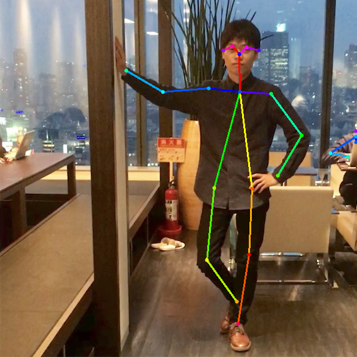
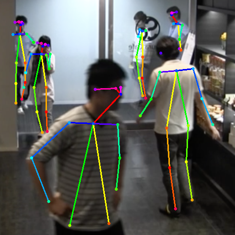

# Under construction

[Original REAMDE.md](./README_original.md)

## Network Structure


**Used Layer types**  

    type: "constant"
    type: "gaussian"
    type: "Concat"
    type: "Convolution"
    type: "Pooling"
    type: "ReLU"

### Environment for test

- python3
- chainer==5.2.0
- ubuntu 16.04
- eog

## Download and first move
```
$ git clone https://github.com/k5iogura/Chainer_Realtime_Multi-Person_Pose_Estimation
$ cd Chainer_Realtime_Multi-Person_Pose_Estimation
```

```
$ cd models
$ wget https://raw.githubusercontent.com/ZheC/Realtime_Multi-Person_Pose_Estimation/master/model/_trained_COCO/pose_deploy.prototxt
$ wget http://posefs1.perception.cs.cmu.edu/OpenPose/models/pose/coco/pose_iter_440000.caffemodel
$ wget http://posefs1.perception.cs.cmu.edu/OpenPose/models/face/pose_iter_116000.caffemodel
$ wget http://posefs1.perception.cs.cmu.edu/OpenPose/models/hand/pose_iter_102000.caffemodel
$ python3 convert_model.py posenet pose_iter_440000.caffemodel coco_posenet.npz
$ python3 convert_model.py facenet pose_iter_116000.caffemodel facenet.npz
$ python3 convert_model.py handnet pose_iter_102000.caffemodel handnet.npz
$ cd ..
```
pose_deploy.prototxt: prototxt carresponding to caffemodel
pose_iter_440000.caffemodel: trained by Multi Persons pose inference
convert_model.py :convert from caffemodel to chainer .npz


```
$ python3 pose_detector.py posenet models/coco_posenet.npz --img data/person.png
$ eog result.png
```



and one more,,,

```
$ python3 pose_detector.py posenet models/coco_posenet.npz --img data/people.png
$ eog result.png
```



## .prototxt, .caffemodel to .bin, .xml IRmodel for OpenVINO

    $ cd models
    $ ln pose_deploy.prototxt pose_iter_440000.prototxt
    $ export MO=/opt/intel/computer_vision_sdk/deployment_tools/model_optimizer/
    $ $MO/mo_caffe.py --input_model pose_iter_440000.caffemodel --output_dir FP16 --data_type FP16 --output Mconv7_stage6_L2,Mconv7_stage6_L1
    $ ls pose_i*
      pose_iter_440000.caffemodel  pose_iter_440000.prototxt
